# Intro

이번 글에서는 CI/CD를 통한 무중단 배포를 구현하기 위해 구른 장대한 삽질의 연대기가 소개될 예정입니다.

무중단 배포와 CI/CD, 듣기만 해도 든든해지는 두 단어가 퓨-젼 해버린다면 어떻게 될까요? 보기만 해도 흐뭇해져버릴 겁니다.

그렇습니다. 지금 실실 웃으면서 키보드를 치고 있는 이유도 그겁니다. 배포 성공, 얼마나 행복한 단어인가요?

# 이렇게 돌아갑니다

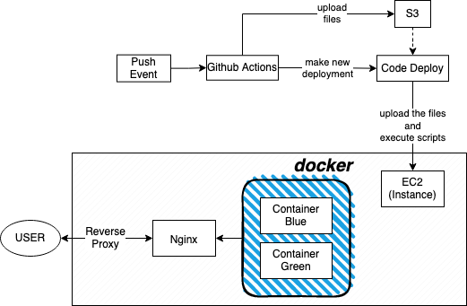

# 준비물

- **Github Actions**
  - Github 저장소의 특정 브랜치로 푸시가 발생했을 때 여러 작업을 실행시킬 수 있습니다
- **Docker**
- **Nginx**
  - 리버스 프록시와 로드 밸런싱을 담당합니다
- **AWS**
  - EC2
  - S3
    - Code Deploy를 통해 코드를 배포하기 전 잠시 저장합니다
  - Code Deploy
    - EC2로의 배포를 담당합니다

# Docker

## 설치

```shell
sudo amazon-linux-extras install docker
```

## Dockerfile

Nextjs를 도커 이미지로 빌드하기 위해선 그에 맞는 Dockerfile이 필요합니다.

```dockerfile
# node_modules를 생성
FROM node:16-alpine AS deps
RUN apk add --no-cache libc6-compat

WORKDIR /app
COPY package.json yarn.lock ./
RUN yarn install --frozen-lockfile

# 생성된 node_modules를 받아 빌드
FROM node:16-alpine AS builder
WORKDIR /app
COPY --from=deps /app/node_modules ./node_modules
COPY . .

RUN yarn build

# 빌드된 파일들을 받아 실행
FROM node:16-alpine AS runner
WORKDIR /app

ENV NODE_ENV production

RUN addgroup --system --gid 1001 nodejs
RUN adduser --system --uid 1001 nextjs

COPY --from=builder /app/public ./public
COPY --from=builder /app/package.json ./package.json

COPY --from=builder --chown=nextjs:nodejs /app/.next/standalone ./
COPY --from=builder --chown=nextjs:nodejs /app/.next/static ./.next/static

USER nextjs

EXPOSE 3000

ENV PORT 3000

CMD ["node", "server.js"]
```

단계를 나눠 nextjs를 빌드한 뒤 실행합니다. 사용할 파일들만 남겨 이미지 크기가 줄어드는 효과가 있습니다.

### enable standalone option

약간의 문제가 있습니다. Dockerfile에서 /.next/standalone이 보이나요? Nextjs는 기본적으로 /.next/standalone을 생성하지 않습니다. 이 디렉토리가 존재하지 않는다면 node 단독으로 실행할 수 없습니다. 설정으로 standalone을 생성하라고 Nextjs에게 알려줘야 합니다.

```js
const nextConfig = {
  ...
  experimental: {
    outputStandalone: true,
  },
  ...
};
```

다음 설정을 next.config.js에 적용하면 빌드 시 standalone이 생성됩니다.

## docker-compose

### 설치

> 🔭 **Reference** https://docs.docker.com/compose/install/compose-plugin/#installing-compose-on-linux-systems

```
curl -SL https://github.com/docker/compose/releases/download/v2.5.0/docker-compose-linux-x86_64 -o /usr/local/bin/docker-compose
```

### 설명

이 글에서는 블루-그린 방식을 통해 무중단 배포를 구현하려고 합니다. 이 때 필요한 게 docker-compose 입니다.

```yml
# docker-compose-blue.yml
services:
  blue:
    image: docker-image
    ports:
      - 3000:3000
```

```yml
#docker-compose-green.yml
services:
  green:
    image: docker-image
    ports:
      - 3001:3000
```

블루, 그린의 역할을 하는 두 개의 docker-compose.yml이 필요합니다. 두 파일의 차이는 포트입니다. 각각 3000, 3001으로 설정했습니다.

# Github Actions

## Environments

Github Actions 워크플로우에 쓰이는 시크릿을 정의해줘야 합니다.

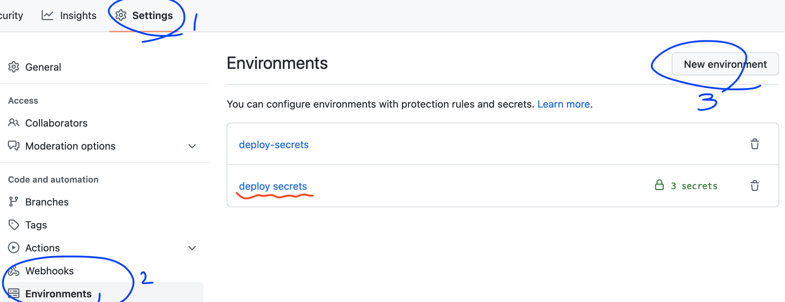

파란색으로 표시된 순서대로 Environments에 접근해 새로운 environment를 만들고 시크릿을 정의해주세요.

## 설명

.github/workflows에 yml을 생성하여 Github Actions의 workflow를 만들어 줄 수 있습니다.

```yml
# Workflow의 이름
name: Tests

# main 브랜치에 푸시가 일어났을 때 이 Workflow를 실행
on:
  push:
    branches: [main]

# 실행될 작업들
jobs:
  build:
    runs-on: ubuntu-latest

    # 특정 Enviroments의 시크릿을 가져옴
    environment:
      name: deploy secrets

    strategy:
      # 생성할 작업의 노드 버전 명시
      matrix:
        node-version: [16.x]

    steps:
      # Repository의 파일들을 가져옴
      - name: Checkout
        uses: actions/checkout@v3

      # 여러 노드 환경을 동시에 만들어 냄
      - name: Node.js ${{ matrix.node-version }}
        uses: actions/setup-node@v3
        with:
          node-version: ${{ matrix.node-version }}

      - run: yarn install
      # 테스트
      - run: yarn ci

      # 생성한 사용자를 이용해 aws에 접근
      - name: Configure AWS credentials
        uses: aws-actions/configure-aws-credentials@v1
        with:
          aws-access-key-id: ${{ secrets.AWS_ACCESS_KEY_ID }}
          aws-secret-access-key: ${{ secrets.AWS_SECRET_ACCESS_KEY }}
          aws-region: ${{ secrets.AWS_REGION }}

      # S3에 업로드하기 위해 파일을 zip으로 압축
      # -x node_modules/\* : node_modules 제외
      - name: Compress the files
        run: zip -qq -r ./$GITHUB_SHA.zip . -x node_modules/\*

      # S3에 생성된 zip을 업로드
      - name: Upload to S3
        run: aws s3 cp --region $AWS_REGION ./$GITHUB_SHA.zip s3://only-deploy-test-bucket/$GITHUB_REPOSITORY/$GITHUB_SHA.zip

      # 업로드 한 zip을 토대로 CodeDeploy에서 새로운 배포를 만들게 함
      - name: Create new Deployment
        run: aws deploy create-deployment --application-name $DEPLOYMENT_APP_NAME --deployment-config-name CodeDeployDefault.AllAtOnce --deployment-group-name $DEPLOY_GROUP_NAME --s3-location bucket=$S3_BUCKET_NAME,bundleType=zip,key=$GITHUB_REPOSITORY/$GITHUB_SHA.zip
```

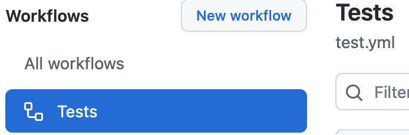

푸시한 Repository로 가서 Actions를 확인해 보면 Tests라는 workflow가 생성된 걸 볼 수 있습니다.

이제 Github Actions는 main 브랜치에 푸시가 들어오면 workflow에 적어준 작업들을 차례대로 실행하고 결과에 따라 성공, 실패를 알려줍니다.

# Shell Scripts

CodeDeploy를 통해 실행될 쉘 스크립트를 만들어 보겠습니다.

## build_docker.sh

```bash
#!/usr/bin/env bash

# 작업할 디렉토리
WORKDIR=/home/ec2-user/temp

cd $WORKDIR
docker build -t docker-tag .
```
첫번째로 실행될 스크립트입니다. 가져온 파일들을 이용해 새로운 도커 이미지를 빌드합니다.

## switch_docker.sh

```bash
#!/usr/bin/env bash

# 실행 중인 도커 컨테이너를 특정할 수 있는 문자열
KEYWORD=running
# 작업할 디렉토리
WORKDIR=/home/ec2-user/temp
cd $WORKDIR

# docker-compose-blue.yml을 통해 실행된 컨테이너들의 목록
IS_BLUE_RUNNING=$(docker-compose -p blue -f docker-compose-blue.yml ps | grep $KEYWORD)
IS_GREEN_RUNNING=$(docker-compose -p green -f docker-compose-green.yml ps | grep $KEYWORD)

if [ -z "$IS_BLUE_RUNNING" ]; then
  docker-compose -p blue -f docker-compose-blue.yml up -d 
  if [ -n "$IS_GREEN_RUNNING" ]; then
    # 슬립을 통해 블루가 완벽히 실행될 때까지의 유예를 줌
    sleep 10
    docker-compose -p green -f docker-compose-green.yml down
  fi
else
  docker-compose -p green -f docker-compose-green.yml up -d 

  # 슬립을 통해 그린이 완벽히 실행될 때까지의 유예를 줌
  sleep 10
  docker-compose -p blue -f docker-compose-blue.yml down
fi
```

두번째로 실행될 스크립트입니다. 빌드된 도커 이미지를 docker-compose를 통해 실행합니다.

현재 그린이 실행되고 있다고 가정합시다. 스크립트는 블루를 새로 실행하고 일정 시간 후 그린을 종료합니다. 이를 통해 서비스를 끊김없이 유지할 수 있습니다. 

# AWS

## EC2 인스턴스 태그 설정

CodeDeploy에서 인스턴스를 구별하기 위해 태그를 사용합니다. 태그 관리로 들어가 새로운 태그를 생성해주세요. 키와 값은 마음대로 생성해도 됩니다.

## EC2에 CodeDeploy agent 설치

> 🔭 **Reference** https://docs.aws.amazon.com/ko_kr/codedeploy/latest/userguide/codedeploy-agent-operations-install-linux.html

CodeDeploy가 EC2 Instance에 파일들을 배포하고 스크립트를 실행하기 위해서는 CodeDeploy agent가 있어야 합니다.

에이전트를 설치하는 방법은 두가지가 있습니다. 하나는 AWS Systems Manager를, 다른 하나는 명령줄을 이용합니다. 이번에는 명령줄로 설치해보겠습니다.

```shell
sudo yum update

sudo yum install ruby

sudo yum install wget
```

먼저 필요한 패지키들을 받아야 합니다. yum을 업데이트 후 패키지들을 설치해주세요.

```shell
https://docs.aws.amazon.com/ko_kr/codedeploy/latest/userguide/resource-kit.html#resource-kit-bucket-names

wget https://bucket-name.s3.region-identifier.amazonaws.com/latest/install

wget https://aws-codedeploy-ap-northeast-2.s3.ap-northeast-2.amazonaws.com/latest/install
```

그 다음 CodeDeploy agent의 설치 파일을 다운받습니다. 이 파일은 아마존의 리소스 키트 S3 버킷에 위치하고 있습니다. 리전별로 주소가 달라지니 상단의 예시 주소를 참고해 EC2 인스턴스가 해당하는 리전을 찾아 bucket-name과 region-identifier를 알맞게 변경해주세요.

저는 토종 한국인이기 때문에 서울 리전으로 인스턴스를 생성했습니다. bucket-name은 aws-codedeploy-ap-northeast-2, region-identifier는 ap-northeast-2가 되겠네요.

```
chmod +x ./install

sudo ./install auto
```

다운받은 설치 파일을 실행할 수 있도록 권한을 주고 CodeDeploy agent를 설치합니다.

```
sudo service codedeploy-agent status
```

이제 CodeDeploy agent가 제대로 실행되고 있는지 확인해보세요. 실행되고 있지 않다면 직접 실행시켜줘야 합니다.

```
sudo service codedeploy-agent start
```

실행 후 status를 사용해 다시 한 번 확인해 보세요.

## 역할, 사용자 설정

AWS는 IAM을 통해 액세스를 관리합니다. 그 중에서 역할과 사용자를 설정해 줄 겁니다. 역할은 CodeDeploy와 EC2, 사용자는 AWS CLI에 사용됩니다.

### EC2

EC2는 CodeDeploy를 통해 S3에서 zip 파일을 가져와야 합니다. CodeDeploy와 S3의 권한이 필요하겠네요.

1. IAM의 역할로 들어가 역할 만들기로 새로운 역할을 만들어 줍니다.

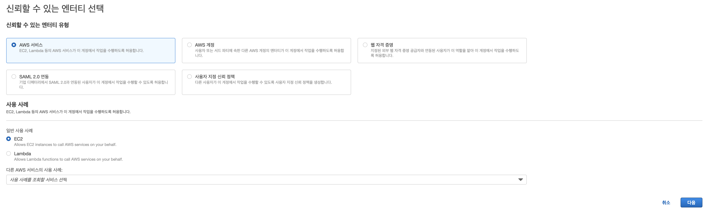

2. 신뢰할 수 있는 엔티티 유형은 AWS 서비스, 사용 사례는 EC2를 선택하고 다음을 누릅니다.

3. 다음은 권한 추가입니다. AmazonS3FullAccess, AWSCodeDeployFullAccess를 검색해 선택하고 다음을 누릅니다.

4. 마지막 화면입니다. 한 눈에 알아볼만한 역할 이름을 적고 역할을 생성해주세요. 설명을 적어도 상관 없습니다.

### CodeDeploy

1. IAM의 역할로 들어가 역할 만들기로 새로운 역할을 만들어 줍니다.

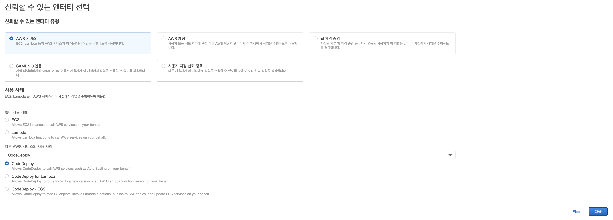

2. 신뢰할 수 있는 엔티티 유형은 AWS 서비스, 사용 사례는 검색을 통해 CodeDeploy를 선택하고 다음을 누릅니다.

3. 다음은 권한 추가입니다. AWSCodeDeployRole가 이미 선택되어 있을겁니다. 다음을 누릅니다.

4. 마지막 화면입니다. 한 눈에 알아볼만한 역할 이름을 적고 역할을 생성해주세요. 설명을 적어도 상관 없습니다.

### AWS CLI

AWS CLI는 액세스 키를 통해 인증을 진행합니다. 액세스 키를 얻기 위해서는 역할이 아닌 사용자를 생성해야 합니다.

AWS CLI를 통해 Github Actions에서 S3에 zip을 업로드하고 CodeDeploy에 새로운 배포를 생성하게 할 겁니다. S3와 CodeDeploy의 권한이 필요합니다.

1. IAM의 사용자로 들어가 새로운 사용자를 만들어 줍니다.

2. 한 눈에 알아볼만한 사용자 이름을 적고 자격 증명 유형에 액세스 키 - 프로그래밍 방식 액세스를 선택해주세요.

3. 권한 설정에 기존 정책 직접 연결로 가서 AmazonS3FullAccess, AWSCodeDeployFullAccess를 찾아 선택해주세요.

4. 태그는 지나쳐도 됩니다.

5. 검토 후 사용자를 생성하세요.

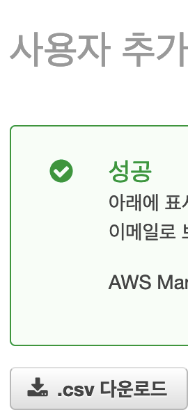

6. 사용자 추가가 성공했다면 반드시 csv 파일을 저장해 놓으세요. 시크릿 키는 이 화면 이후 절대 찾을 수 없습니다.

## CodeDeploy 애플리케이션 및 배포 그룹 생성

이 과정을 통해 어떤 인스턴스에 배포를 수행할지, 어떻게 수행할지 정해줄 수 있습니다.

### 애플리케이션

1. CodeDeploy > 애플리케이션에서 애플리케이션을 생성하세요

2. 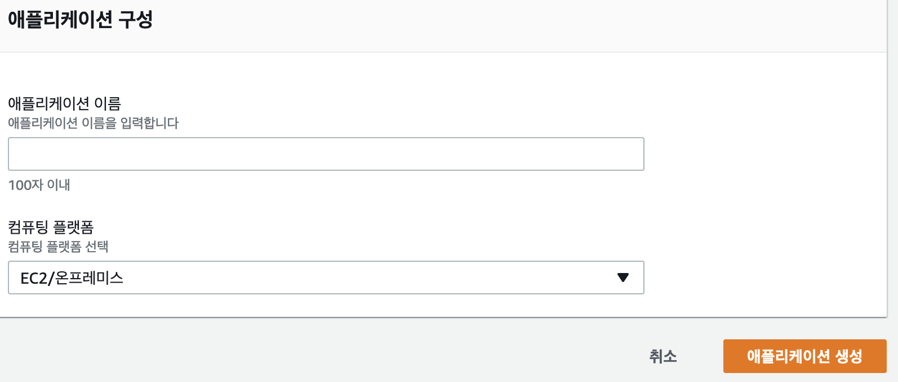
   한 눈에 알아볼만한 이름을 적고 컴퓨팅 플랫폼으로 EC2/온프레미스를 선택해주세요

### 배포 그룹

1. 생성한 애플리케이션에 들어가 배포 그룹을 생성하세요

2. 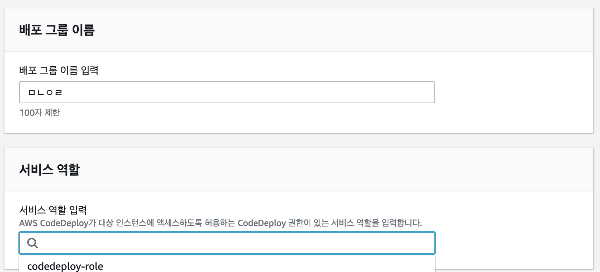
   한 눈에 알아볼만한 이름을 적고 전에 생성한 CodeDeploy 역할을 선택해주세요

3. 배포 유형은 현재 위치를 선택해주세요

4. 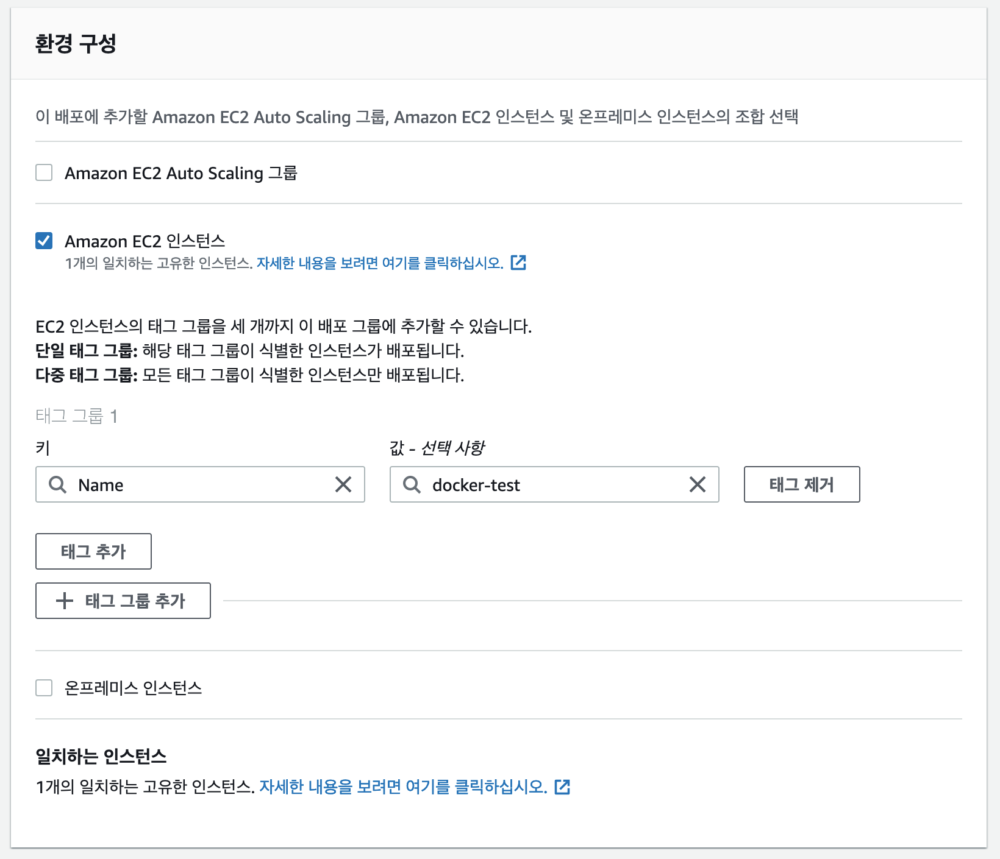
   Amazon EC2 인스턴스를 선택 후 알맞은 태그를 선택해주세요

5. 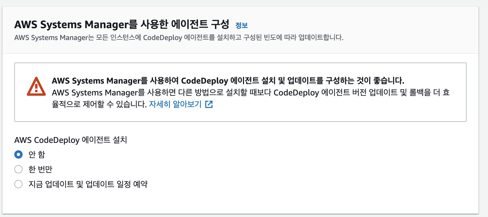
   CodeDeploy agent는 이미 설치했으니 안 함을 선택해주세요

6. 배포 그룹을 생성합니다

## EC2 역할 연결

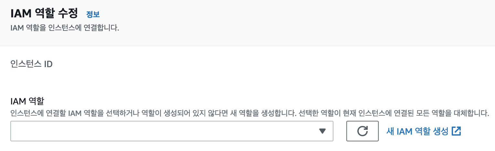

CodeDeploy로 배포할 인스턴스의 IAM 역할 수정에서 EC2에 해당하는 역할을 적용해주세요.

## appspec.yml

```yml
version: 0.0
os: linux
# source에서 destination(ec2 instance)로 파일들을 옮김
files:
  - source: /
    destination: /home/ec2-user/temp

# 실행할 스크립트 정의
hooks:
  AfterInstall:
    - location: /scripts/build_docker.sh
  ApplicationStart:
    - location: /scripts/switch_docker.sh
```

appspec.yml은 배포 시 CodeDeploy가 할 행동을 정의합니다.

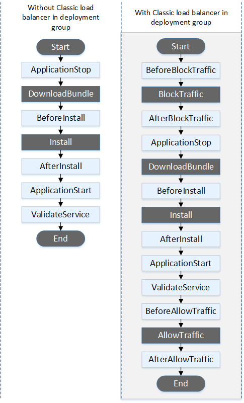

hooks의 실행 순서는 다음과 같습니다. 그렇다면 build_docker.sh 실행 후 switch_docker.sh를 실행하게 되겠네요.

# Nginx

## 설치

```shell
sudo amazon-linux-extras install nginx1
```

## 설명

```conf
http {
    # 요청을 전달할 주소들의 집합
    upstream backends {
        server localhost:3000;
        server localhost:3001;
    }

    server {
        listen       80;
        server_name  localhost;

        # / 로 들어온 요청을 upstream backend로 전달
        location / {
            proxy_pass http://backends;
        }
    }
}
```

생각해보면 이상하지 않나요? 블루와 그린은 각각 3000, 3001 포트에서 실행되고 있는데 사용자는 대체 어떻게 접근해야 할까요? 두 포트를 던져주고 하나 안되면 다른 걸로 접속하라고 해야 할까요? 매력적인 제안이지만 안타깝게도 그건 진정한 무중단 배포라고 볼 수 없습니다.

Nginx가 등장할 차례입니다. Nginx는 리버스 프록시 기능을 제공합니다. 외부에서 특정 주소로 들어온 요청을 다른 곳으로 보내줄 수 있습니다. 이 과정에서 로드 밸런서의 역할도 겸합니다. 따로 설정을 안해줬으니 Nginx은 라운드로빈 방식으로 요청을 전달합니다. 한 번은 localhost:3000에, 한 번은 localhost:3001에 말이죠.

한 번 블루에서 서비스가 실행되고 있는 상태에서 새로운 배포가 들어와 그린을 실행 시키고 블루가 꺼지는 상황을 생각해 보겠습니다.

1. Nginx는 블루로 요청을 전달하고 있습니다
2. 그린이 켜집니다
3. Nginx은 블루와 그린에 번갈아 요청을 전달합니다
4. 블루가 꺼집니다
5. Nginx는 이제 그린에만 요청을 전달합니다

이제 사용자는 하나의 주소에 접속해도 항상 성공적으로 서비스에 접근할 수 있습니다.

# 마무리

> 🔭 **Reference** https://docs.nginx.com/nginx/admin-guide/load-balancer/http-health-check/

사실 삽질을 좀 많이 했습니다. 처음엔 S3에 코드를 업로드하지 않고 Github Actions에서 도커 이미지를 빌드한 다음에 도커 저장소에 푸시하고 배포 때 가져오는 걸 생각했었습니다. 그런 와중에 도전해보는 김에 싹 다 훑어보려고 S3에 업로드하는 방향으로 틀었는데 꽤 만족스럽네요. 몇 번 배포를 돌려보면서 S3에 zip이 좀 쌓였는데 그거 둘러보는 재미가 쏠쏠합니다.

사실 블루-그린 방식의 개념은 굉장히 쉽습니다. 원래 돌아가는 건 가만히 놔두고 다른 곳에 배포한 다음에 바꿔치기하면 완전 무중단 배포 아니에요? 맞습니다. 그게 무중단 배포죠!
그러나 언제나 그렇듯이 실제 구현으로 가는 길은 과속 방지턱이 잔뜩 박혀있습니다. 글로 정리하면 생각보다 짧은 과정인데 실제는 시간이 꽤 걸린 것 처럼요.
한 번은 실마리가 보여서 엑셀을 잔뜩 밟은 적도 있는데 꽤 혼났습니다. 과속 방지턱이 역시 무섭긴 무섭습니다.

Health Check에 대한 것도 말하지 않을 수 없네요. Nginx Open Source는 Passive Health Check만 지원합니다. 외부에서 요청이 들어왔을 때만 Health Check가 가능하죠. 일정 주기로 확인해주는 Active Health Check는 Nginx Plus에서만 제공됩니다.
Active Health Check에 대해 진지하게 생각하고 있다면 Nginx Plus를 결제하거나 처음부터 해당 기능을 지원하는 HAProxy를 찾아보세요.

그렇습니다. 생각보다 말이 길어졌네요. 이 글이 여러분들에게 도움이 됐으면 좋겠습니다. 그럼 이만!