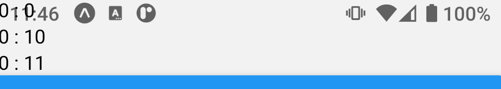

Expo는 라우팅과 내비게이션에 `React Navigation`을 추천하고 있습니다. stack, bottom tab과 같은 내비게이터로 앱 개발에 도움을 주죠.
덕분에 꽤 많은 도움을 받았어요. 그래요, 다 좋았는데...!

여러분, `React Navigation`에겐 비밀이 하나 있습니다. 바로 상태바 따위 신경쓰지 않는다는 겁니다!

# 마이웨이



보이나요? 상태바를 당당히 점거하고 있는 저 모습을요?! 상태바는 물론 아래의 내비게이션 바도 잡아먹고 있어요...!

그저 Badass 마이웨이인 저 모습, 당연히 용납할 수 없습니다. 버릇을 고쳐줘야 해요!

# SafeAreaView

놀랍게도 방법은 태초부터 있었습니다. 처음 expo 프로젝트를 만들었을 때 SafeAreaView라는 컴포넌트가 사용되고 있었던 겁니다!
그런데 저는 멋도 모르고 그걸 시원하게 지워 버리고 View로 바꾼거죠(...). 무슨 기능을 하는지 몰랐거든요!
안전한 영역을 제공한다는 건 알겠는데 그게 정확히 어떤 영역인지도 모르겠고...

결국 그 안전한 영역이라는 건 상태바와 아래 내비게이션 바를 뺀 영역이라는 의미였던 겁니다!

```tsx
<SafeAreaView>...</SafeAreaView>
```

다음과 같이 SafeAreaView로 감싸주세요. 알아서 상태바와 내비게이션 바의 높이를 계산해 그만큼 간격을 넣어줍니다.

# ...

정말 간단하죠?

...... 여러분은 이러지 마세요...

https://docs.expo.dev/guides/configuring-statusbar/

https://docs.expo.dev/versions/latest/sdk/safe-area-context/
