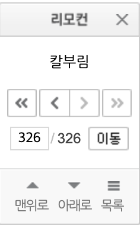
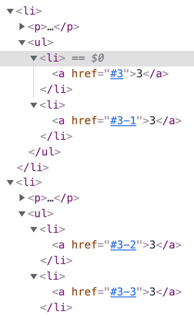
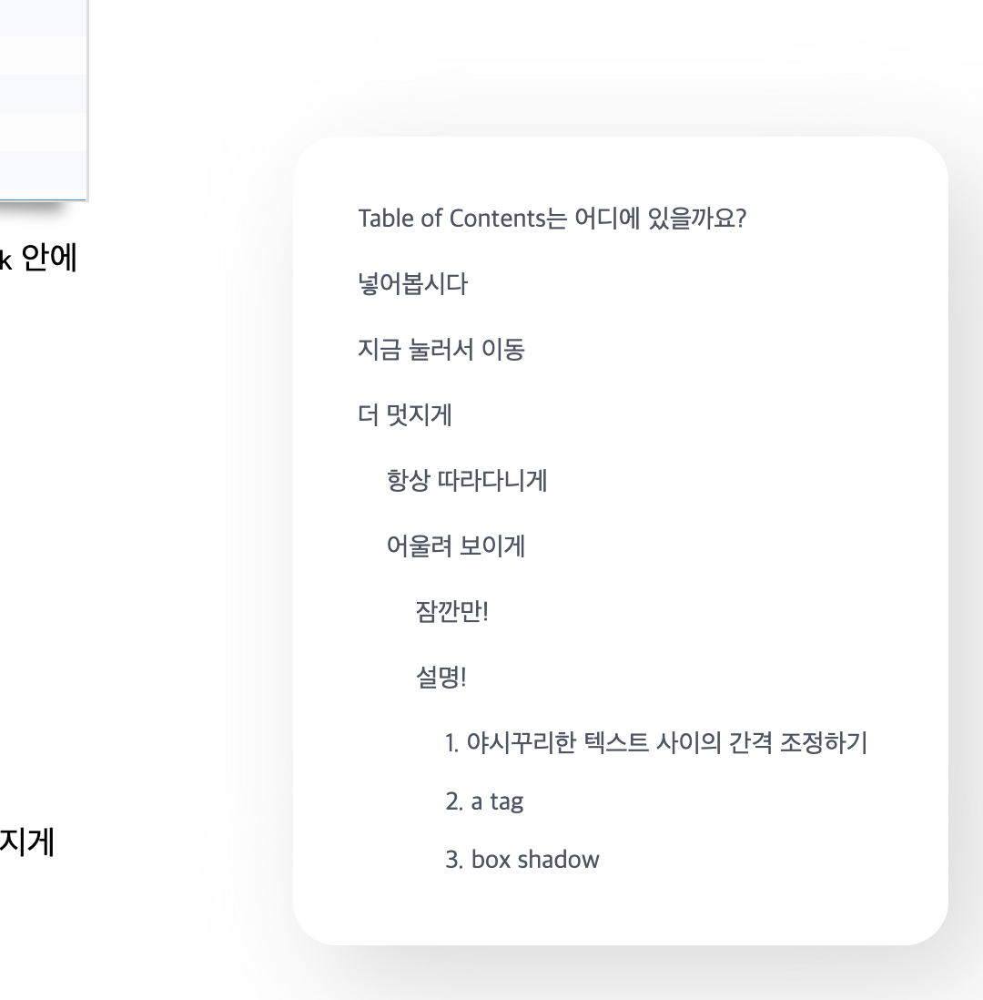

# TMI

Notion에서도 그렇고, 블로그에서도 그렇고 글을 쓰는 게 만족스럽지 않았습니다. 한 눈에 글의 구조를 파악할 수 없었거든요.
사실 Notion도 Table of Contents를 지원하기는 해요! 하지만 글 어딘가에 넣어주는 방식으로만 사용이 가능합니다.

저는 글을 읽을 때도 따라다니며 한 눈에 글의 구조를 파악할 수 있는 Table of Contents를 원했습니다.
혹시 옛날 데스크탑으로 보던 네이버 웹툰 기억하나요? 그 오른쪽에 항상 따라다니는 작은 리모컨처럼 말이죠!



마침 Gatsby로 블로그를 만들어서 마음대로 건드릴 수 있겠다, 꿈의 Table of Contents를 만들기로 했습니다!

# Table of Contents는 어디에 있을까요?

[gatsby-transformer-remark](https://www.gatsbyjs.com/plugins/gatsby-transformer-remark/)

Markdown heading들을 어떻게 가져오나.. 걱정하던 시절이 저에게도 있었습니다. 근데 이게 그냥 있더라구요!

```graphql
allMarkdownRemark {
  id
  html
  tableOfContents
  frontmatter {
    title
    date(formatString: "MMMM DD, YYYY")
  }
}
```

`tableOfContents`가 보이시나요? 맞습니다. `gatsby-transformer-remark` 자체에서 지원합니다!

무려 html까지 직접 만들어서 전해줍니다. 우리가 할 건 이 html을 사용할 엘리먼트에 넣어주는 것 밖에 없습니다. 와...

# 넣어봅시다

정말 간단합니다. 처음 마크다운을 템플릿 페이지에 넣어 줬던 것처럼 하면 됩니다.

```jsx
<div>
  <div dangerouslySetInnerHTML={{ __html: html }} />
</div>
```

끝입니다! 표시된 Table of Contents를 보세요! 멋지지 않나요?

# 지금 눌러서 이동

그 다음은 Table of Contents에서 원하는 heading으로 바로 이동할 수 있게 하는 기능을 구현할 거에요.
이 것도 정말 간단합니다.

```shell
npm install gatsby-remark-autolink-headers
```

```js
// gatsby.config.js
{
  resolve: `gatsby-transformer-remark`,
  options: {
    plugins: [
      {
        resolve: `gatsby-remark-prismjs`,
        options: {
          ...
        },
      },
      `gatsby-remark-autolink-headers`,
    ],
  }
}
```

`gatsby-remark-autolink-headers`를 설치한 다음 `gatsby.config.js`의 `gatsby-transformer-remark` 안에 넣어주세요.

url을 통해 원하는 heading으로 갈 수 있게 해주는 플러그인 입니다.

설치가 끝난 후 Table of Contents의 특정 heading을 눌러보세요. 바로 그 heading으로 날라갑니다!

# 더 멋지게

이제 핵심 기능은 전부 만들었습니다.

근데요, 좀 그렇죠? 생김새가 그다지 멋지지 않아요! 남자로서 용납할 수 없는 부분이죠? 그래서 좀 더 멋지게 만들어 볼 겁니다.

## 항상 따라다니게

먼저 글의 오른쪽에서 항상 따라다니도록 만들거에요.

```jsx
const Container = styled.div`
  ${tw`
  relative
  left-full
  pl-28
  `}
`;

const Contents = styled.div`
  ${tw`
  fixed w-80
  `}
`;
```

```jsx
<Container>
  <Contents dangerouslySetInnerHTML={{ __html: html }} />
</Container>
```

relative를 사용해 `left: 100%`으로 글이 담긴 엘리먼트의 바로 오른쪽에 위치하게 만들어 줍니다.

그 다음, Table of Contents가 담긴 엘리먼트에 fixed를 줘 스크롤에 상관 없이 페이지에 보이게 만들어 줍니다.
거기에 왼쪽 마진을 줘서 글과 살짝 떨어뜨려 줍니다.

```jsx
<SectionContainer>
  {/* Table Of Contents */}
  <Toc html={tableOfContents} />
  <Section dangerouslySetInnerHTML={{ __html: html }} />
</SectionContainer>
```

이제 만들어진 Table of Contents를 글이 담긴 곳의 같은 위치에 둘 거에요. relative는 parent에 맞춰지기 때문입니다.
만약 다른 곳에 Table of Contents 컴포넌트를 둔다면 어디에 있는지 보이지도 않는 대참사가 일어날 수 있어요.
꼭, Table of Contents가 따라다닐 컴포넌트와 같은 위치에 두세요.

자, 이제 원하는 글에 들어가 보세요. 옆에서 따라다니는 게 보이시나요?

## 어울려 보이게

그래도 솔직히 구리죠? 너무 옛날 스타일이에요!

```jsx
const Container = styled.div`
  ${tw`
  relative
  left-full
  pl-28
  `}

  /* 리스트 스타일 없애기, 기존의 padding 사이즈 줄이기 */
  ul {
    ${tw`
    list-none
    pl-4
    `}
  }

  /* 첫번째를 제외한 나머지에 margin-top 주기 */
  li {
    ${tw`first:m-0 mt-3`}
  }

  /* heading이 사이즈를 넘어서면 ...로 축약 */
  p {
    ${tw`truncate`}
  }

  /* a tag 스타일 초기화. 더 멋진 컬러! 더 멋진 텍스트! */
  a {
    ${tw`
    text-gray-600 hover:text-gray-900 text-sm
    no-underline
    `}
  }
`;

const Contents = styled.div`
  /* 약간의 border-radius와 padding. 미쳐버린 box-shadow */
  ${tw`
  fixed w-80 rounded-3xl p-5 
  `}
  box-shadow: 20px 20px 60px #d9d9d9, -20px -20px 60px #ffffff;
`;
```

그래서 `항상 따라다니게`에서 만든 스타일에 여러가지를 더 붙여줄 겁니다.
요상하게 벌어진 텍스트 사이의 간격과 사이즈를 줄여주고 왠지 멋져보일 거 같은 색깔을 넣어줄 거에요.

### 잠깐만!

그 전에 잠깐! 여러분들이 알고 가야 하는 사실이 있습니다. Table of Contents의 html 구조에 관한 건데요.

Table of Contents의 html은 다음과 같은 구조로 되어 있습니다.

```html
<ul>
  <li>
    <p />
    <ul>
      <li>
        <p />
        <ul... />
      </li>
    </ul>
  </li>
</ul>
```

세상에, 저렇게 `<ul />`이 안으로 계-속 이어져요.

그렇다면 heading은 전부 `<p />`에 들어 있다고 생각할 수도 있겠죠? 놀랍지만, 또 예외가 있습니다...

```md
# 1

## 2

### 3

### 3

## 2

### 3

### 3

## 2
```



이런 구조의 마크다운이 있다고 할 때, 각각의 제일 하단 heading, `### 3` 같은 경우는 그냥 `<li />`에 넣어주고 끝이에요! heading 차별이얏!!

이런 요상한 구조 때문에 `<ul /> <li />` 둘 다 스타일을 적용해줘야 합니다. 헉...

### 설명!

#### 1. 야시꾸리한 텍스트 사이의 간격 조정하기

간격, 진짜 개판입니다! 이 것들을 전부 덮어 씌울거에요!

```jsx
/* 리스트 스타일 없애기, 기존의 padding 사이즈 줄이기 */
ul {
  ${tw`
  list-none
  pl-4
  `}
}
```

먼저 리스트 앞의 기호들을 전부 없애고 padding 크기를 조금 줄여 줄 거에요. 기존은 padding 크기가 너무 컸거든요.

```jsx
li {
  ${tw`first:m-0 mt-3`}
}
```

li에도 약간의 간격을 넣었습니다. 아까 ul, li 둘 다 스타일을 적용해줘야 한다고 했죠? li에 heading이 바로 저장된 경우를 대비해
여러 li가 존재한다면 상단에 간격을 넣어주기로 했어요.

#### 2. a tag

모든 텍스트는 실제로는 a tag 안에 들어가 있습니다. 그래서 a tag의 스타일도 조금 손을 봐줄 거에요.

```jsx
a {
  /* a tag 스타일 초기화. 더 멋진 컬러! 더 멋진 텍스트! */
  ${tw`
  text-gray-600 hover:text-gray-900 text-sm
  no-underline
  `}
}
```

기본 색깔은 연한 회색 계열로, a tag에 마우스를 올리면 진한 회색 계열로 달라지게 했습니다.
크기도 조금 줄여 줬어요. 너무 크면 멋지지 않아요!

거기에 a tag의 고질병이 있죠? underline도 꼭 없애줘야 해요!

#### 3. box shadow

마지막입니다ㅏㅏ!

꽤 멋있어 졌지만 아쉬운 부분이 있어요. 바로 외부와 Table of Contents를 구별해주는 게 없다는 거에요!

```jsx
const Contents = styled.div`
  /* 약간의 border-radius와 padding. 미쳐버린 box-shadow */
  ${tw`
  fixed w-80 rounded-3xl p-5 
  `}
  box-shadow: 20px 20px 60px #d9d9d9, -20px -20px 60px #ffffff;
`;
```

그래서 만들었습니다. 테두리를 둥그렇게 깎고 그림자를 먹였어요!



어때요. 멋져 보이나요?

# 마무리

결과물을 보니 정말 만족스러워요. 이런 환경을 원했다니까요? 이제 글을 쓸 때도 훨씬 편할 거 같아요.

여러분들은 어떤가요? 별로라구요? ...이해하겠습니다.

여담으로 말하는 건데 사실은 지금 저 스타일이 아닌 `Neumorphism` 스타일로 만드려고 했어요.


저 움푹 튀어나오고 들어간 게 진짜 마음에 들었거든요. 근데 저 느낌을 그대로 살리려면 배경색이 하얀 색이면 안돼요.
그림자를 보면 하얀 색 계열이 포함된 게 보이죠? 저 그림자를 살리기 위해서 어느 정도 전체 배경색을 어둡게 만들어야 되거든요.

그래서 어둡게 만들어 줬더니, 세상에. 블로그 분위기가 팍 쳐지는 거에요. 블로그 컨셉을 그저 하얀색으로 잡았기 때문에 용납할 수 없었습니다.

...... 아쉬워라...

언젠가 써볼 날이 오겠죠? 와야 될텐데...
