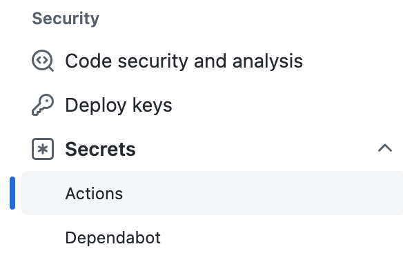
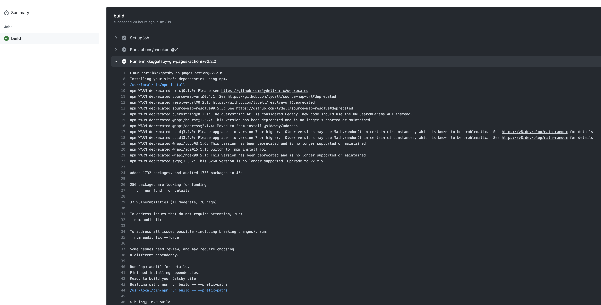

원래 b:Log는 Github Pages에 gh-pages를 통해 손수 배포를 했었습니다. 잘 쓰고 있었지만 아뿔사, 로컬에서 빌드를 돌려 배포를 하다 보니 다듬어지지 않은 글까지 같이 올라가는 대참사가 발생했습니다. Git에 커밋된 것만 빌드가 되게 해주고 싶은데 기존 방법은 아무래도 그게 힘들었어요.

# Github Actions

> 🔭 **Reference** https://github.com/features/actions

Github Actions는 Github에서 제공하는 기능 중 하나입니다. 무려 특정 브랜치의 활동을 감지한 다음 미리 정의해둔 작업을 수행합니다. 작업은 빌드가 될 수도 있고, 배포가 될 수도 있습니다. 테스트도 가능합니다!

이 것을 활용해 b:Log 저장소의 master 브랜치에 커밋이 감지되면 빌드 후 배포가 자동으로 이뤄지게 만들 겁니다. 커밋만 하면 알아서 다 해주는 이 환경! 너무 멋지지 않나요..?

## main.yml

> 🔭 **Reference** https://docs.github.com/en/actions/learn-github-actions/understanding-github-actions

> **Reference** https://github.com/marketplace/actions/gatsby-publish

> 📘 **Workflow?** Github Actions에서 수정 가능한 자동화된 프로세스를 의미합니다. 하나 또는 여러 개의 작업을 포함 가능하며 Event를 통해 실행됩니다.

그러기 위해서 새로운 Workflow를 만들어줘야 합니다.

```yml
name: Gatsby Publish

on:
  push:
    branches:
      - master

jobs:
  build:
    runs-on: ubuntu-latest
    steps:
      - uses: actions/checkout@v1
      - uses: enriikke/gatsby-gh-pages-action@v2.2.0
        with:
          access-token: ${{ secrets.ACCESS_TOKEN }}
          deploy-branch: gh-pages
          gatsby-args: --prefix-paths
```

- **name**
  - 해당 Workflow의 이름
- **on**
  - Event 정의
  - master 브랜치에 푸시가 들어오면 Workflow 실행
- **jobs**
  - 작업들
- **build**
  - 작업의 이름, 무엇이든 될 수 있음
- **runs-on**
  - 실행되는 환경
- **steps**
  - 실행될 작업을 정의
- **uses**
  - 사용할 Action을 정의
  - actions/checkout@v1
    - 저장소에서 체크아웃을 통해 코드를 가져옴
    - 저장소에서 코드를 가져와야 한다면 반드시 사용해야 함
  - enriikke/gatsby-gh-pages-action@v2.2.0
    - 이 Action을 통해 gatsby로 작성된 b:Log의 빌드 및 배포를 수행
    - **with**
      - Action이 사용할 옵션을 정의함
      - deploy-branch: 배포 시 `gh-pages` 브랜치에 커밋
      - access-token: 사용할 Github Access Token

Workflow는 프로젝트의 `.github/workflows` 디렉토리에 `*.yml` 형식으로 저장됩니다. 로컬에서 파일을 만들어 커밋해도 되고 Github 저장소 페이지에서 Actions를 통해 생성할 수도 있습니다. Github에서 생성하면 나중에 로컬로 가져오는 것도 잊지 마세요!

Workflow에 사용되는 Action의 경우 여러 출중한 실력의 개발자가 미리 만들어 놓은 것을 가져와 쓸 수 있습니다. 이번엔 `gatsby-gh-pages-action`로 Gatsby로 만들어진 b:Log를 빌드하고 배포하려고 합니다. 고마워요, `enriikke`!!

## 쉿, 비밀!

Workflow 작성 끝? 진짜 끝? 아닙니다. 오류가 뜰 거에요! 바로 `ACCESS_TOKEN`이 Secret Key로 등록되지 않았기 때문입니다.



저장소의 `Setting`에 들어가면 하단에 `Secrets > Actions`가 있습니다. 들어가서 `New repository secret`을 클릭해 등록해 주세요.

## package.json 점검

```json
// Before
{
  ...
  "scripts": {
    "start": "gatsby develop",
    "build": "gatsby build --prefix-paths",
    "deploy": "npm run clean && npm run build && gh-pages -d public -b gh-pages",
    "serve": "gatsby serve --prefix-paths",
    "clean": "gatsby clean"
  }
  ...
  "devDependencies": {
    "gh-pages": "^3.2.3",
    "twin.macro": "^2.8.2"
  }
}
```

```json
// After
{
  ...
  "scripts": {
    "start": "gatsby develop",
    "build": "gatsby build",
    // "deploy": "npm run clean && npm run build && gh-pages -d public -b gh-pages",
    "serve": "gatsby serve --prefix-paths",
    "clean": "gatsby clean"
  }
  ...
  "devDependencies": {
    // "gh-pages": "^3.2.3",
    "twin.macro": "^2.8.2"
  }
}
```

먼저 deploy를 없애줬습니다. Github Actions을 통해 빌드에 배포까지 되니까 필요가 없어졌습니다! 그렇다면 마찬가지로 배포 때 사용하던 `gh-pages`도 필요가 없어졌습니다. 잘 가렴, `gh-pages`!

build의 `--prefix-paths`는 `*.yml`에 적혀있습니다. 그대로 두면 두 번이나 적히게 됩니다. 없애주도록 합시다.

# 마무리

자, 이제 다시 Actions로 돌아가 잘 작동하고 있는지 확인해 보세요.



너무너무 잘되고 있네요! 나는 너희들이 자랑스럽단다...!!

이제 저와 더불어 여러분들은 Github Actions을 통해 Gatsby를 빌드 및 배포까지 가능한 사람이 되어버렸습니다! 더 나아가 테스트까지 붙여줄 수 있겠네요. 여러분들이 귀찮아하던 반복 작업들을 간단히 자동화시킬 수 있게 된 겁니다!

당장 가서 Github Actions의 매력에 더 깊이 빠져보시길 바라겠습니다. 그럼 다음에 만나요!
