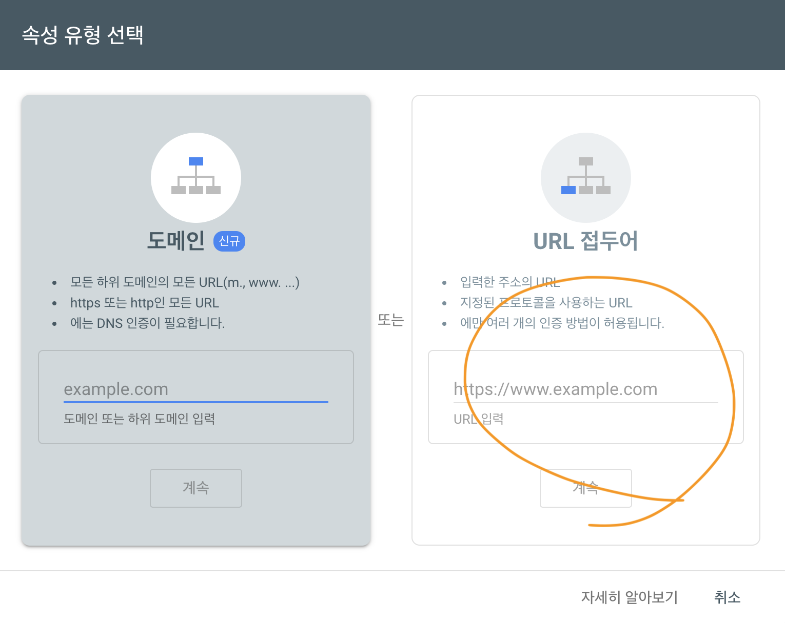

놀라운 사실, 사실 b:Log는 구글에 노출이 되지 않은 상태였습니다! 이 글을 쓰고 있는 당시에도 말이죠. 막연히 SEO만 잘 갖춰 놓으면 언젠간 크롤링 하겠지라고 생각했지만 아무래도 제 안의 K-빨리빨리가 결국 한계에 부딪힌 것 같습니다. 이건 비밀인데, 사실 b:Log도 더 이상은 못참겠다고 하네요..! 어쩔 수 없어요. 정말이에요!

그런고로 이 글은 구글에 b:Log을 노출시키기 위한 여러 시도들이 적혀 있습니다. 미래에 방문하실 여러분들은 팝콘과 같이 즐겨주시면 아주 감사하겠습니다. 아, 이걸 빠트렸네요. 과거에서 전합니다. 반갑습니다, 여러분!

# Google Search Console

그럼 어떻게 해야 구글이 b:Log를 훑어 가게 만들 수 있을까요? 다행히도 구글은 `Google Search Console`을 만들어 뒀습니다. 노출되고 싶은 자, 직접 문을 두드리도록 해라! 암요, 두드려 드려야죠.

## Verification



등록하는 방법은 쉽습니다. `URL 접두어`에 블로그 url을 입력하면 되는거죠. 저같은 경우는 `https://5h5ong.github.io/b-log/`이 될 거에요. 다만 인증이 필요합니다. "이거 내가 등록한 거 맞아요!" 라고 블로그에 적어두는 거죠.

여러가지 방법이 있습니다. html 파일, meta tag... 따로 파일을 추가하긴 싫으니 meta tag를 쓰겠습니다.

```jsx
// Inside SEO Component
<Helmet>
  ...
  {/* Google Search Engine Verification */}
  <meta
    name="google-site-verification"
    content="hXzBIUorkHEVsO9Jb_mIDuDqsTRSzyOx9rvhZ3GrZj8"
  />
</Helmet>
```

> 📘 **TMI** Helmet은 `react-helmet` 패키지에서 왔습니다. head tag 안의 내용을 Helmet 안에 적어둔 것으로 덮어씌워 줍니다.

아까 위에서 블로그 url을 입력했죠? 그 url로 접속했을 때 태그를 확인할 수 있게 만들어야 합니다. b:Log의 페이지는 모두 SEO 컴포넌트를 사용하니 그 안의 Helmet에 meta tag를 넣어 줬습니다. 이러면 언제든지 인증이 되겠죠?
