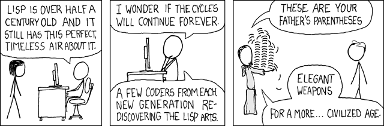

Clojure의 근본이 무엇일까요? LISt Processer, Lisp요! 맞아요, 오래된 역사를 가지고 있는 언어죠! Clojure가 가지고 있는 흉악한 괄호들이 바로 Lisp에서부터 이어져 온 유산입니다. 물론 좋은 점도 이어 받았죠!

그런데 그거 아시나요? 이 언어로 만들어진 에디터가 있다는 사실을?


바로 이맥스 입니다! 순수 Lisp와는 쪼금 다른 Emacs Lisp라는 사투리를 사용하고 있지만.. 그래도 Lisp 입니다! 애초에 에디터가 Lisp로 만들어 졌으니 Lisp에 대한 지원도 든든합니다. 그렇다면 Clojure도 Lisp의 자식이니 기대해봐도 되지 않을까요? idea + cursive를 사용하기로 결정했지만 어김없이 옆 길로 눈이 돌려진 저는 일단 더 자세히 찾아보기로 했습니다.

정말 기상천외 하더라구요. 이메일은 물론 git 클라이언트까지 Emacs 안에서 사용하는 모습이 상상이 되나요? 거기에다 Cider로 Clojure 지원까지 되다니요? 이건 깔아봐야 되겠네요..

# Doom Emacs

https://github.com/hlissner/doom-emacs

근데 그 분들처럼 Emacs를 지지고 볶기 위해선 설정을 굽는 시간이 꽤 오래 걸립니다. 거기에 Emacs의 단축키는 정말 엄청나거든요. control+c control-l 처럼 밥 먹듯이 컨트롤 키가 들어가요! Vim에 비하면 새끼손가락이 남아나질 않는 구조입니다. 그래서 보통 evil로 vim 스타일의 단축키를 사용해요. 결국 또 설정이 늘어납니다. 살려줘!

다른 사람들도 비슷하게 생각했는지 자주 쓰이는 패키지를 모아 설정을 미리 구워둔 Doom Emacs가 탄생합니다. 무려 vim 스타일의 단축키를 기반으로요. 깔고, 쓰기만 하면 됩니다!

## Install

```shell
git clone --depth 1 https://github.com/hlissner/doom-emacs ~/.emacs.d

~/.emacs.d/bin/doom install
```

Emacs의 설정 파일을 doom emacs의 것으로 바꾼 다음 `doom install`을 통해 설치합니다.

환경 변수 PATH에 `.emacs.d/bin`을 등록해 사용해도 좋습니다.

## Conifg

### init.el

> 🔭 **Reference** https://github.com/hlissner/doom-emacs/blob/master/docs/modules.org#editor

`init.el`에서 실제 사용할 기능들을 제어할 수 있습니다.

```lisp
:completion
company           ; the ultimate code completion backend
;;helm              ; the *other* search engine for love and life
;;ido               ; the other *other* search engine...
;;ivy               ; a search engine for love and life
```

init.el의 부분 중 하나입니다. 코드 작성 때 completion을 담당하는 `company`를 사용할 수 있게 주석을 지워놨네요.

`init.el`을 수정한 후엔 `~/.emacs.d/bin/doom sync`으로 설정과 패키지를 동기화해야 합니다. 그 후 Emacs를 껐다 키면 바뀐 설정이 적용됩니다!

#### Basic

```lisp
:ui
modeline          ; snazzy, Atom-inspired modeline, plus API
nav-flash         ; blink cursor line after big motions
neotree           ; a project drawer, like NERDTree for vim
(popup +defaults)   ; tame sudden yet inevitable temporary windows
unicode           ; extended unicode support for various languages
workspaces        ; tab emulation, persistence & separate workspaces
```

- modeline
  - 에디터 하단에 여러 상태를 표시하는 바를 보여줌
- nav-flash
  - 큰 움직임이 있을 때 커서를 깜빡여줌
  - 덕분에 커서 찾기 쉬움!
- neotree
  - 왼쪽 창에서 디렉토리와 파일을 조회할 수 있음
- unicode
  - "KOREAN"
- workspaces
  - workspace를 만들어 여러 작업 상태를 만들어 두고 옮겨다닐 수 있음

```lisp
:term
vterm             ; the best terminal emulation in Emacs
```

- vterm
  - 터미널, 터미널!

#### Clojure

> 🔭 **Reference** https://github.com/hlissner/doom-emacs/blob/master/modules/lang/clojure/README.org

```lisp
:lang
(clojure +lsp)           ; java with a lisp
```

- (clojure +lsp)
  - clojure 개발을 위한 환경
  - +lsp를 붙여 language server를 사용할 것
    - 다른 네임스페이스의 함수 자동 완성, 참조 등이 lsp가 없다면 제대로 지원되지 않음

### package.el

> 🔭 **Theme** https://github.com/doomemacs/themes

```lisp
(setq user-full-name "5h5ong"
      user-mail-address "call5h5ong@gmail.com")

;; 폰트
(setq doom-font (font-spec :family "hack" :size 15))

;; 줄 간격
(setq-default line-spacing 4)

;; 테마
(setq doom-theme 'doom-vibrant)

;; org 디렉토리
(setq org-directory "~/org/")

;; 줄번호를 상대적으로
(setq display-line-numbers-type 'relative)
```
