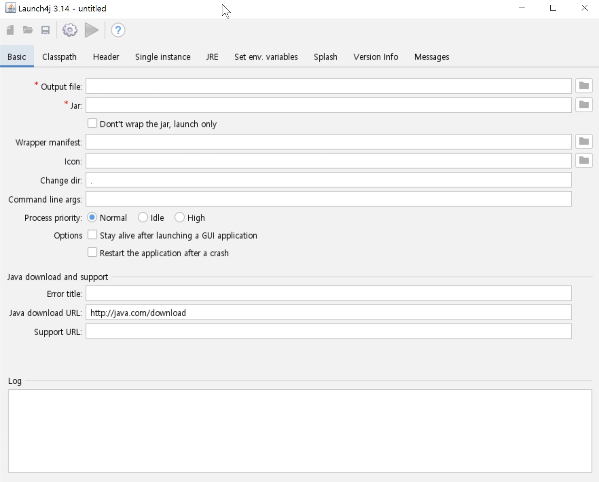
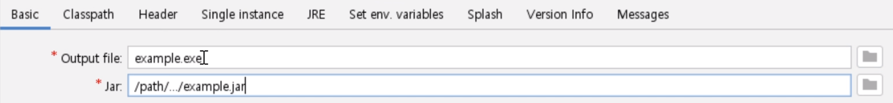
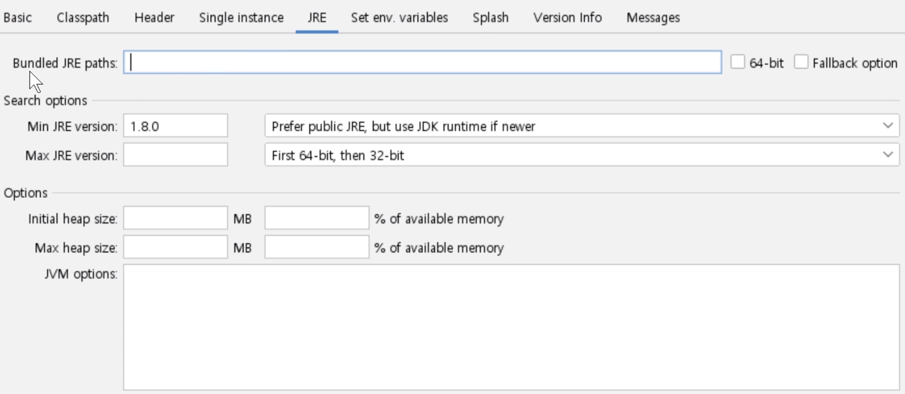
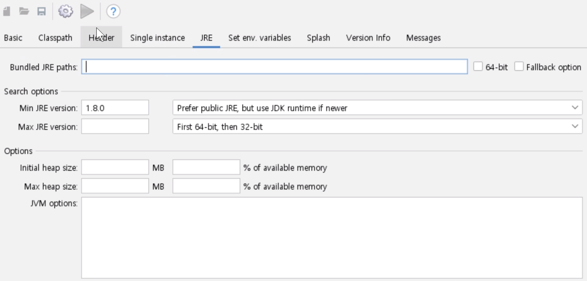

요즘 진짜루 clojure에 푹x2 빠져 버렸어요.. 그런데 열심히 찍먹하고 있는 중 문제가 생겼습니다!
컴파일을 통해서 나온 jar은 java을 사용해야 하거든요. 이게 무슨 당연한 소리야? 알고 있습니다, 여러분. 조금만 더 들어주세요!

```shell
java -jar example.jar 어쩌구 저쩌구
```

jar을 실행하기 위해서는 `java -jar`를 항상 사용해서 돌려야 된단 말이죠. 누가 그걸 좋아 하겠어요?
배포된 앱을 항상 저런 접두사 비스무리 한 걸 붙여서 사용해야 한다면 저는 안쓸겁니다. 네? 여러분은 쓸거라구요? 흥입니다 흥.

물론 자바에게 악감정은 없어요! 아니다, 쪼금은 있나..? 여튼, 가상머신의 축복이자 저주에 빠진 example.jar을 excutable로
만들어주는 방법을 쥐 잡듯이 찾아 봤습니다. 하여튼 사서 고생이에요, 그죠?

# Launch4j

사실 윈도우와 저는 애증의 관계입니다. 윈도우 위에서 개발할 때마다 쓸 데 없이 부딪히는 잔에러가 너무 많아요!
그래서 윈도우 excutable은 안 만들고 jar 쓰세요~ 하려다가 결국 오랫동안 같이 산 의리를 생각해서 먼저 만들기로 했습니다.
잘 나가니까 어쩔 수 없이 그런 건 아니에요. 진짜.

그래서 찾아낸 게 `Launch4j` 이라는 앱이에요. 꽤 유서 깊습니다. 무려 jar을 감싸서 exe로 만들어 줍니다!



요렇게 예쁜 화면이 반겨주는데요, 한 번 어떻게 쓰는지 알아 봅시다.



`Basic` 탭은 어디로 exe 파일을 내보낼 건지, 감싸질 jar는 어디에 있는지를 입력 받습니다.


`Header` 탭에서는 감싸질 jar이 gui인지, console인지 입력 받습니다.



`JRE` 탭은 사용할 jre에 대한 설정을 입력 받습니다. `Min JRE version`는 꼭 필요합니다.



자, 모든 설정이 끝났습니다. 좌측 상단의 톱니바퀴 아이콘을 누르면 빌드가 시작됩니다!
아, xml 파일을 저장하라는 창이 뜨면 어딘가에 잘 저장해 주세요. 저장 후 빌드가 알아서 시작될 겁니다.

다행입니다. Windows에서 jar을 감싼 executable을 얻을 수 있게 됐습니다!

# GraalVM native-image

Windows는 끝났으니 unix의 차례 입니다. 원래 unix도 `Launch4j`를 사용하려 했는데 이상하게 내키지가 않더라구요.
다른 방법을 찾아야 할 거 같았습니다.

그래서 찾아보니 `GraalVM`이라는 게 있더라구요!

자바로 만들어진 고성능 JIT 컴파일러를 통해 속도도 완전 빠르고, 자바가 아닌 다른 언어들도 돌아가고, 여러 장점이 있는 새로운 jvm 입니다.
기존의 C++로 만들어진 자바 컴파일러가 소생 불가 판정을 받았으니 이를 극복하기 위해 만들어 진 거 아닐까..
여튼, 다 좋지만 지금 중요한 건 그게 아니에요. 그 안의 `native-image`를 봐야 해요!

무려 Standalone excutable을 만들어 준대요! VM 위에서가 아닌 네이티브로 돌아가게 만들어 준다는 거에요! 헉, 바로 이거야..!

## Install

### GraalVM

명색이 jvm이니 그에 걸맞은 설치를 해줘야 하겠죠?

https://github.com/graalvm/graalvm-ce-builds/releases/tag/vm-22.0.0.2

- 맞는 버전의 GraalVM 다운로드
- 자바 디렉토리에 압축 해제 ex) `/Library/Java/JavaVirtualMachines`
  - /usr/libexec/java_home -V 을 통해 확인 가능
- 환경변수 설정(JAVA_HOME, PATH)
  - JAVA_HOME : /Library/Java/JavaVirtualMachines/graalvm-...-.../Contents/Home
  - PATH : /Library/Java/JavaVirtualMachines/graalvm-...-.../Contents/Home/bin

만약 os x 카탈리아 위의 버전에서 `‘graalvm...’은(는) 손상되었기 때문에 열 수 없습니다.`와 같은 오류가 발생하면 quarantine 속성을
때줘야 합니다.

```shell
sudo xattr -r -d com.apple.quarantine /path/to/GRAALVM_HOME
```

`GRAALVM_HOME`은 `/graalvm-.../` 디렉토리 입니다. Contents라던지 Home이라던지가 아니에요!

### native-image

```shell
gu install native-image
```

native-image은 GraalVM 설치 후 따로 설치해야 합니다.

## Usage

```shell
native-image -jar example.jar
```

옵션은 기존 자바 컴파일 할 때와 비슷하다네요. 조금만 기다리면 네이티브 excutable이 짠하고 등장합니다. 멋지다...

# 어떤게 좋아요?

사이즈는 확실히 Launch4j가 작아요. 하지만 명심해야 할 것, Launch4j가 만든 excutable은 네이티브가 아니라는 것!
결국 jre가 필요해요. 아까 위에서 최소 요구 jre를 적어줬었죠?

native-image는 사이즈가 크지만 이해할 수 있어요. 무려 네이티브 excutable이니까요! jre가 있던 없던 혼자 돌아가니까요!!

저는 GraalVM에 마음이 가네요. 나중에 윈도우도 실험해본 뒤에 native-image를 사용해서 새로 excutable을 만드는 게 좋겠어요. 이 좋은 걸 왜 몰랐을까!
