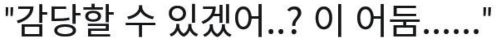

# 선생님, 저는 CSS가 싫어요!

CSS, 웹의 숙명과도 같지만 막상 작업에 들어가면 살짝 질리는 느낌이 있습니다. 왜? 너무 귀찮거든요!

보더 넣어주고, 마진 넣어주고. 중앙 정렬 해주고 텍스트 크기 맞춰주고.. 어 저거 조금 어울리지 않는 거 같은데?
다시 마진 쪼금 수정해주고, 또 마음에 안들죠? 또 수정하죠? 네, CSS의 연옥에 빠져버린 겁니다.



결국 저는 미래의 저에게 시그널을 보낼 수 밖에 없었습니다. 미래의 나. 감당할 수 있겠어.. 이 "어둠"을...?


안돼!! 블로그에서도 그런 일을? 절대, 이 것만큼은 양보할 수 없었어요!!
그렇게 결정된 겁니다. 블로그는 TailwindCss를 쓰자. 거기에 Styled Components까지 쓰까먹자!

## Styled Components

Styled Components는 때놓을 수 없는 저의 영혼의 동반자와도 같은 친구입니다.
사실 Gatsby 문서에서는 `emotion`과 `Tailwind`를 엮어쓰는 걸 보여주지만 이미 암묵적 거래관계를 맺고 있는 Styled Components를 포기할 수 없었어요.

어떻게 영혼의 동반자를 포기합니까? 안 그래요, 여러분?

여러분들은 이러지 마세요...

### 설정

```shell
npm install gatsby-plugin-styled-components styled-components babel-plugin-styled-components
```

설치 후, `gatsby.config.js`의 `plugins`에 다음과 같이 명시 해주세요.

```js
module.exports = {
  plugins: [`gatsby-plugin-styled-components`],
};
```

이제 Styled Components를 사용할 준비가 완료 됐습니다! 다음으로 넘어가 봅시다.

## Tailwind CSS

**`TailwindCSS`가 무엇이냐?** 라고 물어본다면 대답해 드리는 게 인지상정.

... 뭐 대단한 건 없구요, 기존에 열심히 작성하던 css를 훨씬 간단한 표현으로 줄여 쓸 수 있다는 거에요.

예를 들어 **특정 부분에 마우스를 가져다 대면 텍스트의 색깔을 정열의 빨간색으로 바꾸게 해주고 싶다.**
이 걸 구현하려면 css는 ::hover 안에 색깔을 입력하고.. 그런 과정을 거쳐야 했지만 과연 Tailwind는 어떻게 적어낼 수 있느냐!

```plain
hover:text-red-900
```

저 아름다움이 보이시나요? 마우스를 가져다 대면 텍스트를 새빨간 색으로! 저리 단순하게 작성이 가능합니다!

저, 사랑에 빠져버린 걸지두..

그럼 한번 Gatsby에서 사용할 수 있게 만들어 봅시다!

### 설정

tailwind는 보통 html element의 class를 통해 스타일을 적용합니다. 하지만 저는 이번에 그러지 않을 거에요.

대신 Styled Components에 `tw.macro`를 사용해 tailwind를 사용해 볼 겁니다!

`tw.macro`는 babel의 macro를 통해 만들어진 tailwind plugin 입니다. 이걸로 쉽게 tailwind를 사용할 수 있어요.

```shell
npm install tailwindcss
```

```shell
npm install -D twin.macro
```

위와 같이 tailwind와 twin.macro를 설치해 주세요. 다 됐나요? 그럼 다 끝났습니다. ??

## 사용 해보기

> 저는 max-width를 정하고 중앙 정렬을 한 다음 위, 아래에 마진을 쪼금 먹여주고 싶구요. 타이틀의 텍스트를 크게 만들었으면 좋겠어요!

```js
const Container = styled.div`
  ${tw`max-w-screen-md m-auto my-40`}
`;

const Title = styled.h1`
  ${tw`text-4xl`}
`;
```

이게 끝입니다!

`Container`에 max-width를 screen-md(768px)로, margin: auto를 통해 중앙정렬, 위, 아래 마진을 40(10rem).

`Title`의 font-size를 4xl(2.25rem)으로.

너무 간단하지 않나요?? 모두들 빨리 tailwind의 세계로 빠져들게 됐나요? 그럼 당장 적용하러 가세요! 저도 마저 즐기러 가겠습니다. ㅃㅃ!
