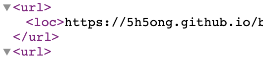

# TMI

원래는 사이트맵을 만들지 않으려고 했습니다. 등록해 놓으면 구글에서 알아서 긁어 주겠지 라는 안일한 마음을 가졌던 겁니다. 구글은 그렇게 만만하지 않았습니다. 악으로 깡으로 버텨보려고 했지만 결국 여기까지 왔습니다. 사이트맵을 만들어야 합니다...!

# 과정

## Reference

> 🔭 **Reference** https://www.gatsbyjs.com/plugins/gatsby-plugin-sitemap/

```jsx
{
  resolve: `gatsby-plugin-sitemap`,
  options: {
    query: `
    {
      allSitePage {
        edges {
          node {
            path
          }
        }
      }
      site {
        siteMetadata {
          siteUrl
        }
      }
    }`,
    resolvePages: ({ allSitePage: { edges } }) => {
      return edges.map(({ node: { path } }) => ({ path: path }));
    },
    serialize: ({ path }) => ({
      url: `${path}`,
    }),
  },
}
```

## 데이터 가져오기

```graphql
{
  allSitePage {
    edges {
      node {
        path # 각 페이지들의 경로
      }
    }
  }
  site {
    siteMetadata {
      siteUrl # 사이트의 주소 (ex. https://example.com)
    }
  }
}
```

사이트맵에 사용될 정보를 graphql 쿼리를 통해 가져와야 합니다.

- allSitePage : 모든 페이지들의 정보를 담고 있음
- site : 사이트의 주소를 담고 있음

여기서 얻은 path, siteUrl로 실제 url을 완성하게 됩니다.

### resolveSiteUrl()

저는 이미 siteUrl을 siteMetadata에 적어뒀기 때문에 resolveSiteUrl()를 사용하는 대신 쿼리에 포함 시켰습니다. 쿼리에 포함시킨 경우엔 플러그인이 알아서 처리합니다.

```jsx
{
	resolveSiteUrl: () => siteUrl,
}
```

쿼리에 적는 것이 별로다, 생각하는 분들은 다음과 같이 작성하면 됩니다.

## resolvePages()

```jsx
{
  resolvePages: ({ allSitePage: { edges } }) => {
    return edges.map(({ node: { path } }) => ({ path: path }));
  };
}
```

resolvePages()를 통해 가져온 데이터를 받아 가공해 줄 수 있습니다.

앞서 쿼리로 가져온 데이터는 함수 파라메터를 통해 사용할 수 있습니다. 간단하게 allSitePage의 edges에 있는 path들을 가져와 층을 얇게 만들어 리턴해 줬습니다.

## serialize()

```jsx
{
  serialize: ({ path }) => ({
    url: `${path}`,
  });
}
```

serialize()의 리턴값으로 사이트맵이 어떻게 생성될지 결정됩니다.

이 함수는 앞서 나온 resolvePages()의 리턴값에 map()을 사용할 때의 콜백 함수로 사용된다고 보면 됩니다. 첫번째 파라메터로 map()을 통해 얻은 데이터를 받습니다.



생성된 사이트맵의 구조입니다. <url> 안에 제대로 된 url이 보입니다.
