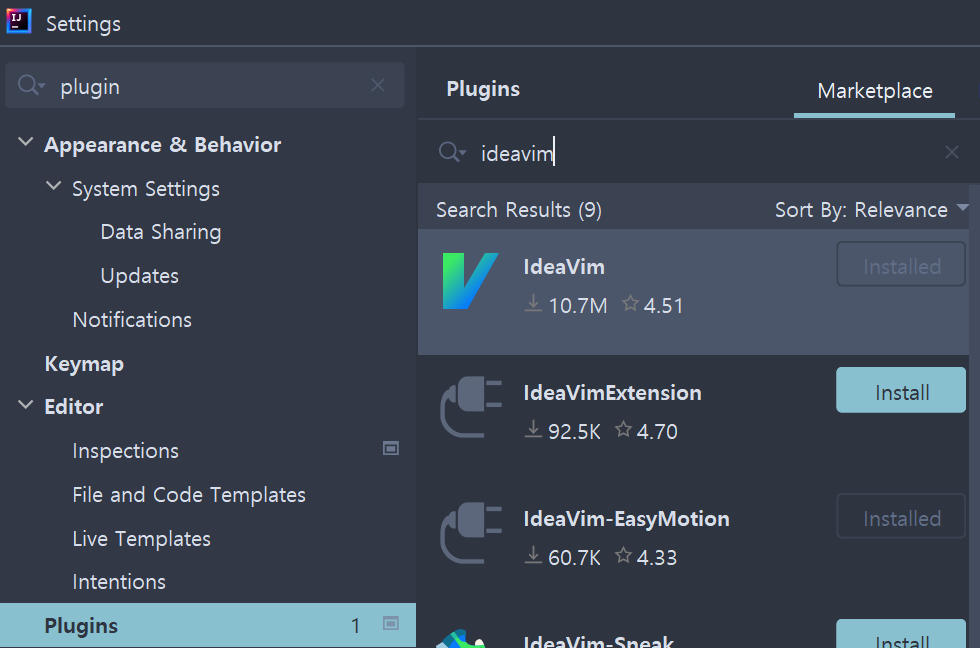
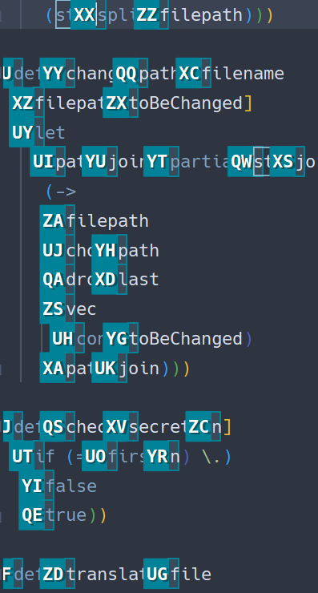

요즘 clojure에 푹 빠졌습니다. 참 재밌더라구요. 자바 lib도 쉽게 가져다 쓸 수 있구요.

그런데 vscode에서 clojure를 지원하는 익스텐션인 calva의 사용 경험이 너무 좋지 않았습니다.
들여쓰기가 너무 이상해요! repl도 사용하기 먼가 불편한 점이 있었어요. 대체제를 찾아야 할 필요성을 느꼈습니다.
그래서 검색을 좀 해보니 idea + cursive의 궁합이 그렇게 좋다고 하네요?
거기에 idea는 명품 자바 ide로 알려져 있어요. clojure도 자바 기반이에요! 이 무슨 운명적 만남..!

이쯤되면 여러분들도 알겠지만, idea + cursive의 사용 경험은 완벽했습니다!
들여쓰기도 제대로 빠릿빠릿하게 해주고요, repl이요? 와.. 이건 직접 써봐야 알 것 같네요. 완전 쩝니다!

아, 물론 단점도 있었어요. vscode에서 단축키로 창을 슉슉 날라다니던 그게 전혀 안됐단 말이죠.
그렇습니다. 주기적으로 찾아오는 설정의 시간이 다시 돌아온 겁니다. 내가 간다!!

# vim

vim이 없으면 못사는 몸이 되어 버렸습니다. idea에도 vim의 숨결을 불어 넣어주는 작업을 해보겠습니다.

## ideavim 설치

ideavim은 idea에서 vim을 사용할 수 있게 해주는 플러그인입니다. 무려 jetbrains가 직접 관리하고 있으니 믿을만 합니다!



Plugins으로 들어가서 설치하면 됩니다.

## easymotion

https://github.com/JetBrains/ideavim/wiki/Emulated-plugins



easymotion은 vim의 때낼 수 없는 단짝입니다. 몇 번의 타이핑으로 원하는 코드로 날라갈 수 있게 만들어 주죠.
ideavim도 easymotion을 쓸 수 있습니다. 몇 개의 플러그인을 설치한 후에 말이죠.

Plugins에서 IdeaVim-EasyMotion & AceJump를 설치하세요.
그 후 `~/.ideavimrc`에 `Plug 'easymotion/vim-easymotion'`을 적어주세요.

## shortcuts & .ideavimrc

```vim
Plug 'easymotion/vim-easymotion'

" <leader> 키를 스페이스바로
let mapleader=" "

" 줄번호를 상대적으로 표시
set relativenumber

" vim 설정 로드
nnoremap <leader>rr :source ~/.ideavimrc<cr>

" 창 분할
nnoremap sv :action SplitVertically<cr>
nnoremap sh :action SplitHorizontally<cr>

" 창 이동
nnoremap <C-l> :action NextSplitter<cr>
nnoremap <C-h> :action PrevSplitter<cr>

" repl로 이동
nnoremap <leader>jl :action :cursive.repl.actions/jump-to-repl<cr>

" 마지막으로 사용한 툴 윈도우로 이동
nnoremap <leader>jtw :action JumpToLastWindow<cr>
```

| 명령어       | 설명                      |
| ------------ | ------------------------- |
| nnoremap     | 재귀되지 않는 단축키 생성 |
| \<C-h\>      | Ctrl + h                  |
| sv           | s + v                     |
| \<leader\>jl | leader key + j + l        |

모든 설정을 마무리한 후 .ideavimrc는 다음과 같습니다. 이제 키보드를 통해 빠르게 창과 코드를 넘어다닐 수 있습니다!

ideavim은 :action으로 idea의 기능들을 사용할 수 있습니다. action들을 확인하려면 `:actionlist`를 입력해 보세요!
