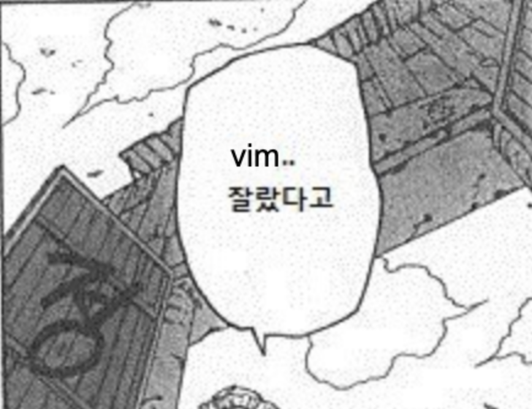

> ✍️ **추가** 2022-03-15 : 한/영 전환

Visual Studio Code는 정말 완벽합니다! 단 하나를 빼고 말이죠. **기본으로 VIM을 지원하지 않아요!!**

엄청난 단점이 아닐 수 없습니다. 조금 움직일 때마다 마우스에 손을 대라니, 키보드에 대한 모욕이에요!

결국 이를 가엽게 여긴 선현께서 익스텐션을 내려주시니, 그 것이 바로 vscodevim입니다.

익스텐션 하나만 깔아주면 직통으로다 vim의 은총을 받을 수 있으니 이 얼마나 완벽한가요? 다만, 세부적인 부분은 직접 설정해줘야 합니다.
예를 들어 윈도우 이동 같은 것들이요!



이 글에서는 그런 설정들을 적용하기 위한 치열한 분투가 적혀갈 예정입니다. SOS! SOS!!

# VscodeVim

[지금 눌러 VscodeVim 무료 체험](https://github.com/VSCodeVim/Vim)

## easymotion은 한글을 싫어해

우리에게 진정한 축지법이 무엇인지 알려주는 easymotion은 정말, **정말!** 안타깝게도 한글을 씹어버립니다. 이 무슨 영어권의 횡포...!

그래서 설정을 살펴보니 모두는 아니라도 JumpToAnywhere Motion의 regex를 바꿀 수 있는 `vim.easymotionJumpToAnywhereRegex`을
제공합니다. 그렇다면 regex를 수정해서 한글 사이도 요리조리 다닐 수 있는 길이 열릴 수도 있지 않을까요??


`vim.easymotionJumpToAnywhereRegex`의 기본값인 `[A-Za-z0-9]\b` 안의 `\b`는 **단어의 경계**에 대응하는 regex의 특수문자입니다.
그럼 저 regex의 대괄호 안에 한글에 대응하는 Character set을 입력해주면 되겠네요! 그럼 `[A-Za-z0-9가-힣]\b`이 될 거에요.

그러나 저 regex는 제대로 작동하지 않았어요. `\b`는 multi-byte charater에는 대응되지 않거든요! 이 무슨 영어권의 횡포...,..!

결국 새로운 방식을 찾기 위해 여러가지로 시도해 보다가 꽤 쓸만한 regex를 만들어 냈습니다!

```plain
[a-zA-Z0-9가-힣](?=\\s|\\.|\\!|\\,|\\?`)
```

- regex 설명
  - [a-zA-Z0-9가-힣] : 영어, 숫자, 한글에 대응하는 Charater set
  - (?=\\s|\\.|\\!|\\,|\\?|\\`)
    - ?= : Positive lookahead
    - 공백, ., ,, ?, ` -> X
- 의미 : X가 뒤따라 오는 Charater set에만 대응

단어와 단어를 나눌 때 쓰이는 공백, 마침표, 물음표와 같은 문자를 중심으로 그 앞에 문자가 영어, 숫자, 한글일 때 대응하게
만들었는데 이게 되네요?

문제.. 해결...?

## vim과 함께하는 윈도우 네비게이션

vscodevim는 윈도우와 관련한 키 스트로크를 제공하지 않아 직접 설정해야 합니다.
윈도우를 키보드로 다룰 수 없다면 vim을 쓴다고 할 수 있을까요? 저는 무슨 일이 있어도 윈도우는 키보드로 관리하는 꼴을 봐야 되겠거든요.

그래서 vscodevim은 저같은 사람들을 위해 vim 키바인딩을 마음대로 설정할 수 있게 해 놨어요.

```json
// settings.json
{
  "vim.normalModeKeyBindingsNonRecursive": [
    // Editor 이동
    {
      "before": ["s", "v"],
      "commands": ["workbench.action.moveEditorToRightGroup"]
    },
    {
      "before": ["s", "p"],
      "commands": ["workbench.action.moveEditorToBelowGroup"]
    }
  ]
}
```

```json
// keybindings.json

{
  "key": "ctrl+k",
  "command": "workbench.action.navigateUp"
},
{
    "key": "ctrl+j",
    "command": "workbench.action.navigateDown"
},
{
    "key": "ctrl+h",
    "command": "workbench.action.navigateLeft"
},
{
    "key": "ctrl+l",
    "command": "workbench.action.navigateRight"
},
// quick open
{
  "key": "ctrl+j",
  "command": "workbench.action.quickOpenSelectNext",
  "when": "inQuickOpen"
},
{
  "key": "ctrl+k",
  "command": "workbench.action.quickOpenSelectPrevious",
  "when": "inQuickOpen"
},
  {
  "key": "ctrl+j",
  "command": "selectNextSuggestion",
  "when": "suggestWidgetMultipleSuggestions && suggestWidgetVisible && textInputFocus"
},
{
  "key": "ctrl+k",
  "command": "selectPrevSuggestion",
  "when": "suggestWidgetMultipleSuggestions && suggestWidgetVisible && textInputFocus"
}
```

짜잔! 위의 설정을 vscode의 `settings.json`와 `keybindings.json`에 적용하면 vim 스타일의 키바인딩을 쓸 수 있습니다.
거기에다 vim에서 자주 쓰이는 ctrl + hjkl을 통한 탐색도 같이 적어 놨어요.

| 키       |                      기능                       |
| -------- | :---------------------------------------------: |
| sv       |                    수평 분할                    |
| sp       |                    수직 분할                    |
| ctrl + h |               왼쪽 윈도우로 이동                |
| ctrl + j | Suggestion, QuickOpen 다음 & 하단 윈도우로 이동 |
| ctrl + k | Suggestion, QuickOpen 이전 & 상단 윈도우로 이동 |
| ctrl + l |              오른쪽 윈도우로 이동               |

저를 전적으로 믿으셔야 합니다. 이 것만 있으면 다 해먹을 수 있어요!

## 한/영 전환

> 🔭 **Documentation** https://github.com/VSCodeVim/Vim#input-method

> 🔭 **im-select** https://github.com/daipeihust/im-select

vscodevim은 영어 입력으로 작동되게 만들어졌습니다. 그래서 한글로 뿌듯한 주석을 작성 후 insert mode로 돌아가면 키가 먹히지 않게 되는겁니다.
`w`는 `ㅈ`가 아니니까요.

물론 vscodevim은 이 것에 대한 해결 방법을 만들어놨습니다. mode가 바뀌면 입력 소스를 지정해놓은 걸로 바꾸는 겁니다. 이를테면 영어라든지요!

### im-select

입력 소스를 바꿔줍니다. 꼭 설치해야 합니다.

```shell
brew tap daipeihust/tap

brew install im-select
```

맥은 brew로 간단히 설치가 가능합니다.

```shell
scoop bucket add im-select https://github.com/daipeihust/im-select
scoop install im-select
```

윈도우는 scoop으로 설치가 가능합니다.

### 설정

```json
// Mac OS
{
  ...
  "vim.autoSwitchInputMethod.enable": true,
  "vim.autoSwitchInputMethod.defaultIM": "com.apple.keylayout.ABC",
  "vim.autoSwitchInputMethod.obtainIMCmd": "/usr/local/bin/im-select",
  "vim.autoSwitchInputMethod.switchIMCmd": "/usr/local/bin/im-select {im}",
                                                                      ^
                                                                  defaultIM
}
```

```json
// Windows
{
  ...
  "vim.autoSwitchInputMethod.enable": true,
  "vim.autoSwitchInputMethod.defaultIM": "1033",
  "vim.autoSwitchInputMethod.obtainIMCmd": "C:\\bin\\im-select.exe",
  "vim.autoSwitchInputMethod.switchIMCmd": "C:\\bin\\im-select.exe {im}"
                                                                    ^
                                                                defaultIM
}
```

- defaultIM
  - mode 변경 시 기본으로 바뀔 입력 소스
  - 운영체제, 입력기에 따라 달라질 수 있음
- obtainIMCmd
  - im-select의 경로
- switchIMCmd
  - defaultIM이 넣어질 곳을 지정

설정은 다음과 같습니다. `settings.json`에 적어주세요.
