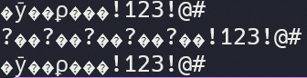
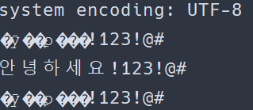
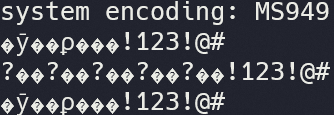

열심히 clojure를 맛보고 있던 어느 날, 난데없이 오류가 터졌습니다.



한글이 깨졌습니다!

뭐지? 인코딩이 잘못됐나? 아닌데, utf-8 맞는데? 맥에서는 잘 돌아가는데? 그래요, 윈도우의 문제였던 겁니다.

# 윈도우의 Encoding

Java는 시스템 인코딩을 그대로 가져와 사용합니다. getProperty()로 `file.encoding`를 불러오면 어떤 인코딩을 쓰고 있는지 확실하게 알 수 있습니다.




보이나요? 저 인코딩의 차이가?? 윈도우는 utf-8이 아닌 MS949(CP949)라는 인코딩을 사용하고 있습니다! 만악의 근원이 바로 저거였던 거에요! 참 이상한 게, Powershell의 인코딩을 유니코드로 바꿔 뒀어도 자바는 우직하게 MS949를 밀고 간다는 점이에요. 이런 곳에서 우직하지 않아도 되는데..

확인해보니 윈도우와는 다르게 리눅스와 Mac OS(unix)는 기본 인코딩으로 utf-8을 사용합니다. 그래서 깨짐없이 깔끔하게 한글이 출력됐던 거죠.

그럼 왜 윈도우만 MS949를 쓰는 걸까요? 재밌게도, 윈도우 커널은 유니코드를 지원하지만 안타깝게도 K-윈도우는 MS949를 그대로 사용하고 있습니다. locale 설정에서 유니코드를 사용할 수 있는 옵션을 제공하지만 베타에 머물러 있어 덥석 사용하기도 어렵습니다. 아무래도 윈도우는 하위 호환성이 중요하니 확 바꾸기에도 부담이 되겠죠.

# Java의 Encoding 바꾸기

그럼 어떡하죠? "utf-8 미만은 입장 금지" 같은 푯말을 달아 놓을 수도 없습니다. 영어를 쓰면 되지 않겠냐구요? 그런 언어 사대주의가 세상을 망칩니다! ...너무 갔나? 여튼, 윈도우에서도 Java가 utf-8을 사용하게 만들어야 합니다.

```shell
java -jar -Dfile.encoding=UTF-8 example.jar
```

> 🔭 **Reference** https://docs.oracle.com/en/java/javase/17/docs/specs/man/java.html

> 🚧 **주의** -Dfile.encoding=UTF-8을 이해하지 못해 제대로 실행되지 않을 수 있습니다. 그럴 때는 "-Dfile.encoding=UTF-8" 처럼 큰 따옴표를 둘러 실행해 보세요.

그 해답은 바로 Property를 바꿔주는 `-Dproperty` argument 입니다. 이를 통해 실행될 앱이 utf-8을 사용하게 만들 수 있습니다.

utf-8로 작성됐는데 윈도우에서 실행되야 한다면 왠만하면 붙여주세요. `Launch4j`에서도 잘 적용됩니다!
